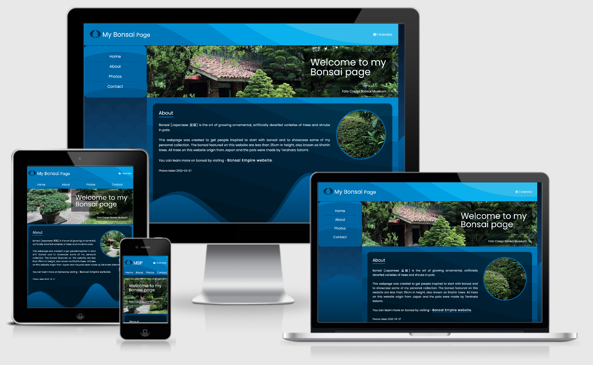

# My Bonsai Page

For the first milestone assignment with Code Institute, I have created a website that showcase some of my personal bonsai collection.
The site is targeted toward people who have an interest in bonsai trees and would like to know more about this hobby and get inspired to start their own collection.

The photos on this website were taken by mittnamnkenny.

[View the live project here.](https://mittnamnkenny.github.io/bonsai-page/)

## User Experience (UX)

-   ### User stories

    -   #### First Time Visitor Goals

        1. As a First Time Visitor, I want to easily understand the main purpose of the site.
        2. As a First Time Visitor, I want to be able to easily navigate throughout the site.
        3. As a First Time Visitor, I want the site to be visually appealing regardless of screen size.
        4. As a First Time Visitor, I want the links to function as expected.

    -   #### Returning Visitor Goals

        1. As a Returning Visitor, I want to learn more about bonsai by visiting Bonsai Empire via the link provided.
        2. As a Returning Visitor, I want know where the collection is located.
        3. As a Returning Visitor, I want to be able to contact the owner of the site.
        
    -   #### Frequent User Goals
        1. As a Frequent User, I want to see if there are any updates in the photo section.